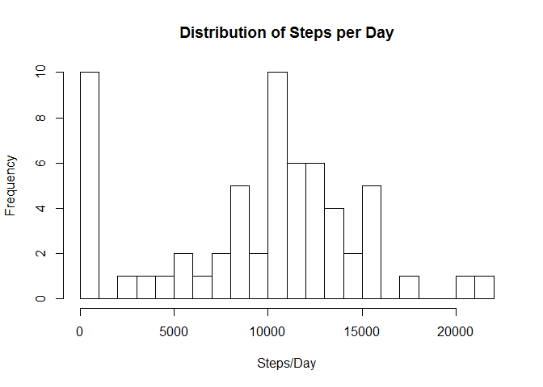
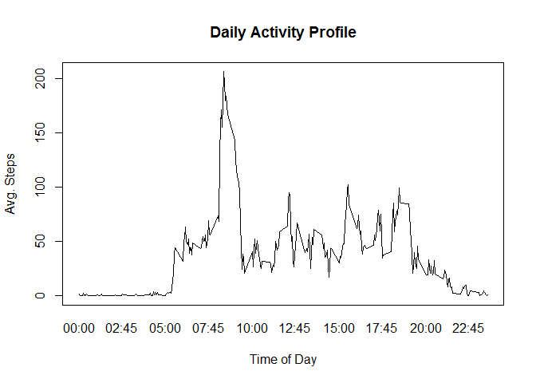
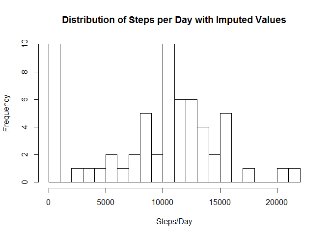
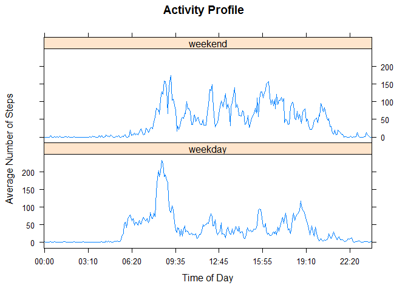

# Reproducible Research: Peer Assessment 1
### Prepared by Bob Hansen

## Loading and preprocessing the data

```r
    activity <- read.csv("activity.csv")        # read file
    activity$date <- as.Date(activity$date)     # set date field as date type
```

## What is mean total number of steps taken per day?

```r
    stepsPerDay <- aggregate(activity["steps"], by=list(activity$date), FUN=sum, na.rm=TRUE)
    hist(stepsPerDay$steps, breaks=25, main="Distribution of Steps per Day", xlab="Steps/Day")
```

 

```r
    steps.mean <- mean(stepsPerDay$steps, na.rm=TRUE)
    steps.median <- median(stepsPerDay$steps, na.rm=TRUE)
    options(digits=2, scipen=7)
```
####The average number of steps taken per day is 9354.23, while the median is 10395.

## What is the average daily activity pattern?

```r
    avgStepsPerInterval <- aggregate(activity["steps"], by=list(activity$interval), FUN=mean, na.rm=TRUE)
    # Add a friendly time factor
        int.high <- avgStepsPerInterval$Group.1 %/% 100
        int.low <- avgStepsPerInterval$Group.1 %% 100
        friendlyTime <- paste0(formatC(int.high, width=2, flag="0"),":", formatC(int.low, width=2, flag="0"))
        avgStepsPerInterval$intStr <- as.factor(friendlyTime)
    
    plot(avgStepsPerInterval$Group.1, avgStepsPerInterval$steps, type="l",
        main="Daily Activity Profile", ylab="Avg. Steps", xlab="Time of Day", xaxt="n")
    axis(side=1, labels=avgStepsPerInterval$intStr, at=avgStepsPerInterval$Group.1, tick=FALSE)
```

 

```r
    mostActiveInterval <- as.character(avgStepsPerInterval[which.max(avgStepsPerInterval$steps), "intStr"])
```
####On average, the most active 5-minute interval occurs at 08:35.

## Imputing missing values

```r
    numMissingValues <- sum(is.na(activity$steps))
    datesWithNoData <- unique(activity[is.na(activity$steps),"date"])   # at least one NA
    datesWithData <- unique(activity[!activity$date %in% datesWithNoData,"date"])
```
####There are 2304 intervals without step counts, and 8 dates with at least one interval with no data.

For any intervals/days that do not have step count data, we replace that entry with the average number of steps taken during that interval for those days that do have data.

```r
    # create new data frame
        act2 <- data.frame(activity)
    # Fill in missing values from average for that interval
        rowsMissingData <-which(is.na(act2$steps))
        act2[rowsMissingData,"steps"] <- avgStepsPerInterval[rowsMissingData,"steps"]
    # plot and calculate with the new data set
        NUstepsPerDay <- aggregate(act2["steps"], by=list(act2$date), FUN=sum, na.rm=TRUE)
        hist(stepsPerDay$steps, breaks=25, 
             main="Distribution of Steps per Day with Imputed Values", xlab="Steps/Day")
```

 

```r
        NUsteps.mean <- mean(NUstepsPerDay$steps, na.rm=TRUE)
        NUsteps.median <- median(NUstepsPerDay$steps, na.rm=TRUE)
```
####With missing values replaced with the average number of steps for that interval, the average number of steps taken per day is now 9530.72, while the median is 10439.
The averages have increased slightly since the intervals with missing data were counted as zero in the oringinal calculations. These new averages are probably more accurate if the missing values were due to not logging the number of steps on those days, while still actually taking the steps.


## Are there differences in activity patterns between weekdays and weekends?

```r
    weekend <- c("Sat", "Sun")
    daytype <- c("weekday", "weekend")
    act2$daytype <- as.factor(daytype[weekdays(act2[,"date"], abbreviate = TRUE) %in% weekend*1 +1])
    
    act2end <- act2[act2$daytype=="weekend",]
    act2day <- act2[act2$daytype=="weekday",]
    avgSPIweekend <- aggregate(steps ~ interval, data=act2end, FUN=mean, na.rm=TRUE)
    avgSPIweekend$daytype <- as.factor("weekend")
    avgSPIweekday <- aggregate(steps ~ interval, data=act2day, FUN=mean, na.rm=TRUE)
    avgSPIweekday$daytype <- as.factor("weekday")
   
#     plot.new()
#     par(mfrow=c(2,1), title(main="Daily Activity Profile"))
#     plot(avgSPIweekend$interval, avgSPIweekend$steps, type="l", xaxt="n")
#     plot(avgSPIweekday$interval, avgSPIweekday$steps, type="l", xaxt="n")
#     axis(side=1, labels=avgStepsPerInterval$intStr, at=avgStepsPerInterval$Group.1, tick=FALSE)
    
    require(lattice)
```

```
## Loading required package: lattice
```

```r
    act2mean <- rbind(avgSPIweekday, avgSPIweekend)
    # Add a friendly time factor
        int.high <- act2mean$interval %/% 100
        int.low <- act2mean$interval %% 100
        friendlyTime <- paste0(formatC(int.high, width=2, flag="0"),":", formatC(int.low, width=2, flag="0"))
        act2mean$intStr <- as.factor(friendlyTime)
    
    myat <- seq(1, nrow(act2mean), length.out = 16)
    mylabels <- act2mean[myat,"intStr"]
    xyplot(act2mean$steps~act2mean$intStr | act2mean$daytype, type="l", layout=c(1,2),
           ylab="Average Number of Steps", xlab="Time of Day", main="Activity Profile",
           scales=list(x=list(at=myat, labels=mylabels)))
```

 

####There appears to be more early morning activity during the week, and more afternoon activity on the weekends.
